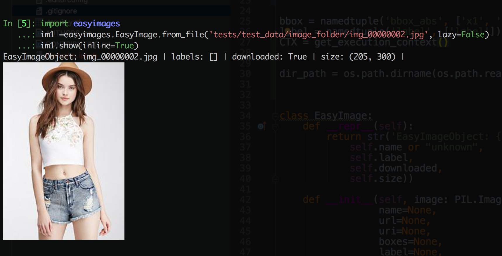
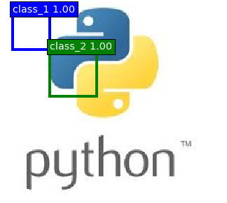
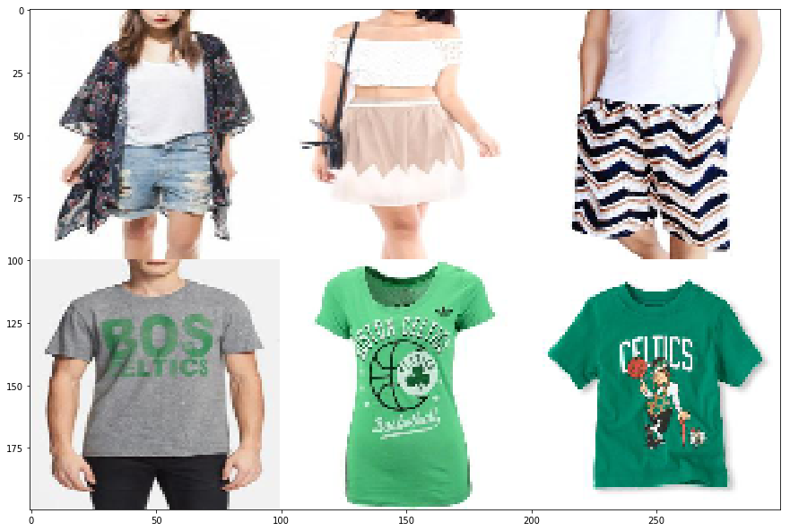
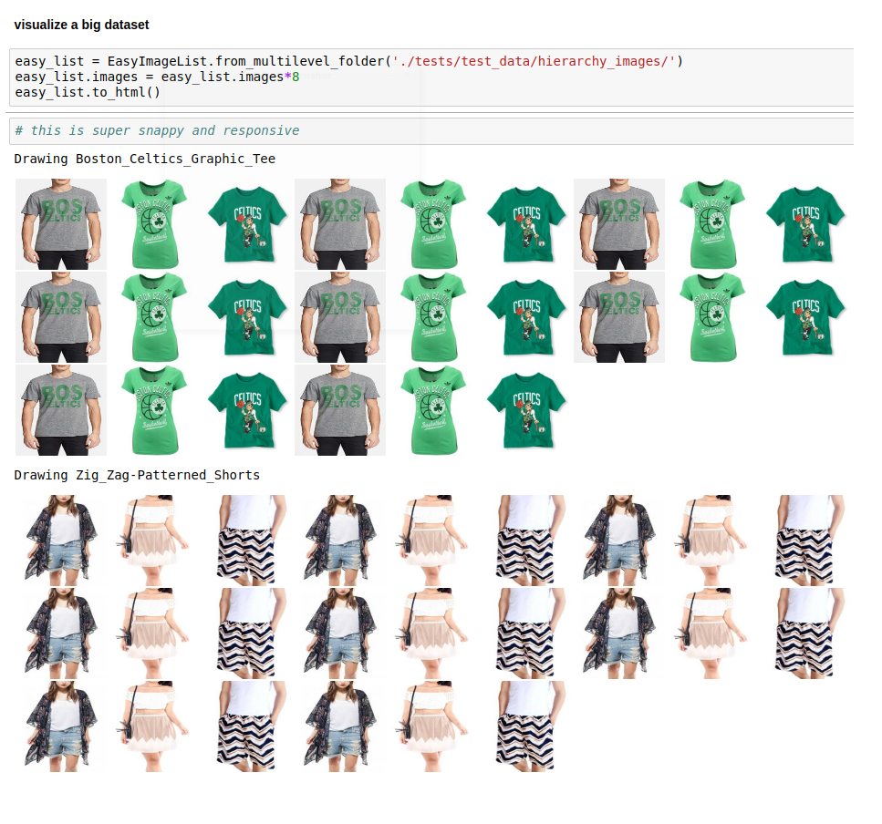

# easyimages

[](https://pypi.python.org/pypi/easyimages)
[](https://travis-ci.org/i008/easyimages)
[](https://pyup.io/repos/github/i008/easyimages/)


# Info

This small but handy package solves several issues i had while working with images and image datasets - especially in the context
of exploring datsets, inspecting and shareing the results.
Keep in mind that his package is not directly related to the training process and loading
image data, for that i found pytorch dataloading patterns to work very well.

# Installation
```bash
pip install easyimages
```


Features
--------
- Simple API
- Easy image exploration
- Inteligent behaviour based on execution context (terminal, jupyter etc)
- Lazy evaluation
- Loading images from many different sources (filesystem, pytorch, numpy, web-urls, etc)
- Storing annotations (tags, bounding boxes) allong the image in the same object
- Visualizing labels (drawing boxes and drawing the label onto the image)
- Visualizing images as Grids (ImagesLists)
- Visualizing huge amounts of images at once (by leveraging fast html rendering)
- Displaying images while working in jupyter notebook
- Displaying images inline in console mode (iterm)


Examples
--------

For detailed examples check the examples notebook


```python
from easyimages import EasyImage, EasyImageList, bbox
import torch
import torchvision
from torchvision import transforms
import PIL
```

# EasyImage


####  image from file


```python
# in this context lazy means the object will store the metadata only and will not open the file just yet
image1 = EasyImage.from_file('./tests/test_data/image_folder/img_00000002.jpg',label=['Person'], lazy=True)
image1.show()
```

    EasyImageObject: img_00000002.jpg | labels: ['Person'] | downloaded: True | size: (205, 300) |


### image from file in CLI (iterm only) :



####  image from url


```python
image2 = EasyImage.from_url('https://imgur.com/KDBRjyv.png')
image2.show()
```

    EasyImageObject: KDBRjyv.png | labels: [] | downloaded: True | size: (237, 212) |


####  image from torch-like


```python
MEAN = [0.485, 0.456, 0.406]
STD = [0.229, 0.224, 0.225]

Trans = torchvision.transforms.Compose([
            transforms.ToTensor(),
            transforms.Normalize(mean=MEAN, std=STD),
        ])
torch_image = Trans(PIL.Image.open('./tests/test_data/image_folder/img_00000003.jpg'))


image3  = EasyImage.from_torch(torch_image, mean=MEAN, std=STD)
image3.show()
```

    EasyImageObject: ef807dcc.jpg | labels: [] | downloaded: True | size: (170, 250) |


#### Draw label on image


```python
image2.boxes = [bbox(10, 10, 50, 50, 1, 'class_1'),
                bbox(50, 50, 100, 100, 1, 'class_2')]
image2.draw_boxes().show()
```

    EasyImageObject: KDBRjyv.png | labels: [] | downloaded: True | size: (324, 291) |





# EasyImageList()


```python
easy_list = EasyImageList.from_multilevel_folder('./tests/test_data/hierarchy_images/')
<ImageList with 6 EasyImages>

```


```python
# sometimes its handy to have a numpy array like image
r = easy_list.visualize_grid_numpy(montage_shape=(3,2))
```





#### visualize a big dataset


